# Runtime Dependency Map

This document maps the live runtime path of the VoiceBot application, centered on the modules that participate in call creation, telecom media handling, AI orchestration, persistence, and teardown.

## Scope

Included:

- HTTP call initiation
- inbound provider webhooks
- shared WebSocket session orchestration
- Azure Realtime integration
- provider adapters
- persistence and in-memory runtime state
- hot-path policy and helper modules

Excluded:

- inactive or weakly connected Phase 4 facade modules unless they influence the live path
- broad static asset and planning docs

## Live runtime graph

```mermaid
flowchart TD
    Client[Client / Campaign] --> Routes[Routes/Routes.js]
    Routes --> Controller[Controller/MainController.js]
    Controller --> Personas[personas/registry.js]
    Controller --> TwilioProvider[adapters/telecom/TwilioProvider.js]
    Controller --> PlivoProvider[adapters/telecom/PlivoProvider.js]
    Controller --> CallRegistry[services/CallRegistry.js]

    TwilioProvider --> CallRegistry
    PlivoProvider --> CallRegistry
    TwilioProvider --> WriteQueue[services/writeQueue.js]
    PlivoProvider --> WriteQueue
    TwilioProvider --> UserRepo[repositories/UserRepository.js]
    PlivoProvider --> UserRepo

    App[app.js] --> Routes
    App --> SessionFactory[session/createCallSession.js]
    App --> WriteQueue
    App --> CallRepo[repositories/CallRepository.js]
    App --> Logger[Utils/logger.js]
    App --> Telemetry[Utils/telemetry.js]

    SessionFactory --> TwilioStream[services-twilio/stream-service-twilio.js]
    SessionFactory --> PlivoStream[services-plivo/stream-service-plivo.js]
    SessionFactory --> TwilioRealtime[services-twilio/realtimeServiceTwilio.js]
    SessionFactory --> PlivoRealtime[services-plivo/realtimeServicePlivo.js]
    SessionFactory --> CallRegistry
    SessionFactory --> WriteQueue
    SessionFactory --> Policy[policy/callInteractionPolicy.js]
    SessionFactory --> Degradation[policy/degradationStateEngine.js]
    SessionFactory --> Ambiguity[policy/ambiguityScoringEngine.js]
    SessionFactory --> Escalation[logic/escalationEngine.js]
    SessionFactory --> AppHelpers[Helper/appHelpers.js]
    SessionFactory --> EmailHelper[Helper/emailHelper.js]
    SessionFactory --> AudioCodec[Helper/audioCodec.js]
    SessionFactory --> RNNoise[Noise-Reducer/noise-reducer.js]

    TwilioRealtime --> Personas
    PlivoRealtime --> Personas
    TwilioRealtime --> HelperBridge[Helper/Helpers.js]
    PlivoRealtime --> HelperBridge
    TwilioRealtime --> Hangup[Helper/hangupDecision.js]
    PlivoRealtime --> Hangup
    TwilioRealtime --> Classifier[Helper/callClassifier.js]
    PlivoRealtime --> Classifier
    TwilioRealtime --> Hallucination[Helper/hallucinationGuard.js]
    PlivoRealtime --> Hallucination
    TwilioRealtime --> ConversationPhase[Helper/conversationPhase.js]
    PlivoRealtime --> ConversationPhase
    HelperBridge --> ConversationRepo[repositories/ConversationRepository.js]
    HelperBridge --> CallRegistry

    WriteQueue --> CallRepo
    CallRepo --> DB[services/db.js]
    ConversationRepo --> DB
    UserRepo --> DB
```

## Layer map

| Layer | Modules | Role |
|------|---------|------|
| Process bootstrap | `app.js` | Starts Express, WebSocket endpoints, queue worker, telemetry bridge, and shutdown handling. |
| HTTP/API | `Routes/Routes.js`, `Controller/MainController.js` | Receives outbound call requests, validates input, resolves personas, selects provider, and returns inbound telecom XML. |
| Telecom abstraction | `adapters/telecom/TwilioProvider.js`, `adapters/telecom/PlivoProvider.js` | Encapsulates provider-specific outbound create, hangup, transfer, start-field normalization, and gate configuration. |
| Session orchestration | `session/createCallSession.js` | Owns per-call edge state, turn state, denoise loop, event routing, policy evaluation, hangup and handover signaling. |
| Realtime AI | `services-twilio/realtimeServiceTwilio.js`, `services-plivo/realtimeServicePlivo.js` | Maintains Azure Realtime socket, session updates, user transcript handling, greeting flow, response lifecycle, and reconnection. |
| Media output | `services-twilio/stream-service-twilio.js`, `services-plivo/stream-service-plivo.js` | Sends provider-formatted audio and playback markers back to telecom WebSockets. |
| Policy and control | `policy/`, `logic/escalationEngine.js`, `config/` | Governs guarded speech, degradation state, ambiguity scoring, escalation, latency compensation, and micro-ack behavior. |
| Helper and classification | `Helper/` | Provides hangup analysis, classification, hallucination checks, tone mapping, audio conversion, and persistence bridge utilities. |
| State and persistence | `services/CallRegistry.js`, `services/writeQueue.js`, `repositories/`, `services/db.js` | Holds active call state in memory and persists call, conversation, and user records to MySQL. |

## Hot-path dependency table

| Module | Depends on | Why it matters |
|-------|------------|----------------|
| `app.js` | routes, providers, stream services, realtime services, write queue, call repository, logger, telemetry | Root wiring point with the highest fan-out in the runtime. |
| `Controller/MainController.js` | persona registry, telecom providers, CallRegistry, phone utils, Plivo status handler | Controls provider selection and fallback before media flow starts. |
| `session/createCallSession.js` | provider contract, stream and realtime service classes, policy modules, helper modules, CallRegistry, write queue, RNNoise, telemetry | Main coordinator for the per-call lifecycle and the densest event graph in the repo. |
| `services-twilio/realtimeServiceTwilio.js` | Azure WebSocket, persona registry, helper bridge, classifier, hallucination guard, hangup analysis, deferred context summarizer | Handles transcript-to-response logic for Twilio sessions. |
| `services-plivo/realtimeServicePlivo.js` | Azure WebSocket, persona registry, helper bridge, classifier, hallucination guard, hangup analysis, deferred context summarizer | Same role as Twilio service with provider-specific timing and protocol behavior. |
| `Helper/contextSummarizer.js` | Azure OpenAI SDK, rate limiter | Deferred support module used by realtime services to compress older turns when conversation history grows. |
| `Helper/Helpers.js` | conversation repository, CallRegistry, telecom providers | Backward-compatible bridge that still participates in live persistence. |
| `services/writeQueue.js` | call repository handler supplied by `app.js` | Single async write buffer for call session persistence. |
| `services/CallRegistry.js` | used by controller, providers, helpers, and session engine | Shared volatile source of truth for active call metadata. |

## Cross-layer edges

These edges are the most important because they cross subsystem boundaries instead of staying within one layer.

| From | To | Impact |
|------|----|--------|
| Controller | telecom providers | Request layer directly invokes vendor operations and fallback logic. |
| Telecom providers | CallRegistry, write queue, repositories | Adapter layer writes both volatile runtime state and persistent state. |
| Session orchestrator | policy, helper, observability, state, provider-injected services | Runtime behavior is distributed across many modules but synchronized from one file. |
| Realtime services | helper persistence bridge and LLM-based hangup analysis | Model events trigger persistence and business decisions outside the service layer. |
| Helper bridge | repositories and CallRegistry | Legacy helper file remains in the hot path, bridging persistence and in-memory transcript state. |

## High fan-out and high fan-in modules

### High fan-out

- `app.js`
- `session/createCallSession.js`
- `services-twilio/realtimeServiceTwilio.js`
- `services-plivo/realtimeServicePlivo.js`

These files are operational choke points because small changes can affect many downstream modules.

### High fan-in

- `services/CallRegistry.js`
- `services/writeQueue.js`
- `personas/registry.js`
- `services/db.js`

These modules are shared resources. Failures or semantic drift here propagate broadly.

## Architectural observations

1. The runtime path is cleaner than older audit documents imply: the shared call-session logic now lives in `session/createCallSession.js` instead of duplicated provider handlers in `app.js`.
2. Provider abstraction is good at the telecom boundary, but state mutation is still shared across controller, adapters, helper bridge, and session code.
3. The active live path still depends heavily on helper modules, especially for persistence and hangup analysis.
4. `logic/phase4Pipeline.js`, `rag/`, and `persona/styleEngine.js` are present as a richer orchestration layer, but they are not the primary active path in the current live runtime.

## Reading order for debugging runtime issues

1. `app.js`
2. `Controller/MainController.js`
3. `session/createCallSession.js`
4. `adapters/telecom/TwilioProvider.js` or `adapters/telecom/PlivoProvider.js`
5. Matching realtime service
6. Matching stream service
7. `Helper/contextSummarizer.js`
8. `services/CallRegistry.js`
9. `services/writeQueue.js`
10. Repository and DB modules