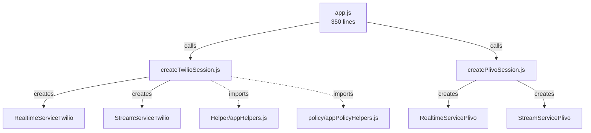

# app.js Refactoring Plan - Safety Analysis

## Overview
Current `app.js` is ~95KB with approximately 2100+ lines. The goal is to extract WebSocket handlers and helper functions into separate, modular files.

## ⚠️ Critical Dependencies That Must Be Preserved

### Global Constants (Lines 168-200)
These are used throughout handlers and must be passed to extracted modules:
- `PHASE2_5_2_UNLOCK_DEBUG` - Phase 2.5.2 debug flag
- `MAX_CLARIFICATIONS` - Max clarification attempts
- `PHASE3_ENABLED`, `PHASE3_DEBUG`, `phase3Config` - Phase 3 config
- `PREWARM`, `PACING`, `MICRO_ACK` - Phase 3 features
- `DEFAULT_POLICY_CONFIG`, `PAUSE_MS` - Policy and pacing

### Required Module Imports
The session managers will need to import:
- `policy/callInteractionPolicy` - InteractionMode, ContextHint
- `policy/callInteractionPolicy` - evaluateSpeechPermission, getDefaultPolicyConfig
- `config/latencyResponsivenessConfig` - Phase 3 config functions
- `config/latencyResponsivenessRuntime` - Runtime utilities
- `Utils/turnGuard` - assertTurnActive
- `Utils/logger`, `Utils/telemetry` - Logging

### Existing Services
- `RealtimeServiceTwilio` - Already extracted to services-twilio/
- `StreamServiceTwilio` - Already extracted to services-twilio/
- Both take constructor dependencies

---

## Current Structure Analysis

### Lines 1-100: Imports & Setup
- 50+ require statements
- Telemetry bridges
- Logger configuration

### Lines 28-55: Helper Functions (to extract)
- `downsampleBuffer()` - Audio downsampling utility

### Lines 58-75: Safety Functions (to extract)
- `assertAudioSafe()` - Audio safety gate
- `epochGuardedTimeout()` - Epoch-guarded timeout helper

### Lines 205-290: Policy Helpers (to extract)
- `assertInteractiveBeforeNonGuardedSend()`
- `isValidHumanTranscript()`
- `transitionMode()`
- `validatePolicyConfig()`

### Lines 370-1210: Twilio WebSocket Handler (~840 lines)
- Session state: `edgeSession`, `turnState`, `callContextState`, `phase3State`
- Denoise worker function
- Message parsing and audio processing
- Event listeners for realtimeService
- Turn management

### Lines 1259-2106: Plivo WebSocket Handler (~850 lines)
- Similar structure to Twilio handler
- Platform-specific differences

---

## Extraction Plan - SAFELY

### 1. Helper Functions → `Helper/appHelpers.js`
Extract these pure functions that have no dependencies on handler state:
- `downsampleBuffer()` - Audio downsampling (no external deps)
- `assertAudioSafe()` - Uses assertTurnActive (can import)
- `epochGuardedTimeout()` - Uses turnState (can be parameterized)

```javascript
// Helper/appHelpers.js
const { assertTurnActive } = require('../Utils/turnGuard');

function downsampleBuffer(buffer, inputRate, outputRate) { /* ... */ }
function assertAudioSafe(turnState, expectedTurnId) { /* ... */ }
function epochGuardedTimeout(turnState, fn, delay) { /* ... */ }

module.exports = { downsampleBuffer, assertAudioSafe, epochGuardedTimeout };
```

### 2. Policy Helpers → `policy/appPolicyHelpers.js`
Extract Phase 2.5/3 helpers that use policy modules:

```javascript
// policy/appPolicyHelpers.js
const { InteractionMode, ContextHint } = require('./callInteractionPolicy');
const { getDefaultPolicyConfig } = require('./callInteractionPolicy');
const telemetry = require('../Utils/telemetry');

function assertInteractiveBeforeNonGuardedSend(interactionMode, PHASE3_DEBUG) { /* ... */ }
function isValidHumanTranscript(userText, opts) { /* ... */ }
function transitionMode(stateObj, nextMode, reason) { /* ... */ }
function validatePolicyConfig(policyConfig, contextHint) { /* ... */ }

module.exports = { 
    assertInteractiveBeforeNonGuardedSend, 
    isValidHumanTranscript, 
    transitionMode, 
    validatePolicyConfig 
};
```

### 3. Twilio Session Factory → `services-twilio/createTwilioSession.js`
**Safe approach**: Create a factory function that receives all dependencies

```javascript
// services-twilio/createTwilioSession.js
const { v4: uuidv4 } = require('uuid');
const { EventEmitter } = require('events');
const { RealtimeServiceTwilio } = require('./realtimeServiceTwilio');
const { StreamServiceTwilio } = require('./stream-service-twilio');
const { mulawToPcm16, pcm16ToMulaw } = require('../Helper/audioCodec');
const { assertTurnActive } = require('../Utils/turnGuard');
const { epochTimeout } = require('../Utils/epochTimeout');

function createTwilioSession(ws, options) {
    // options contains all Phase 2.5/3 configs passed from app.js
    const { 
        PHASE3_ENABLED, PHASE3_DEBUG, phase3Config,
        PREWARM, PACING, MICRO_ACK,
        DEFAULT_POLICY_CONFIG, PAUSE_MS,
        InteractionMode, ContextHint,
        logger, telemetry
    } = options;
    
    // Create session state objects
    const connectionId = uuidv4();
    const edgeSession = { /* ... */ };
    const turnState = { currentTurnId: null, isClosed: false };
    const callContextState = { /* ... */ };
    const phase3State = { /* ... */ };
    
    // Create services
    const realtimeService = new RealtimeServiceTwilio();
    const streamService = new StreamServiceTwilio(ws, turnState);
    
    // Setup event listeners, denoise worker, etc.
    // ...
    
    return { 
        connectionId, edgeSession, turnState, 
        callContextState, phase3State,
        realtimeService, streamService,
        cleanup: () => { /* cleanup logic */ }
    };
}

module.exports = { createTwilioSession };
```

### 4. Plivo Session Factory → `services-plivo/createPlivoSession.js`
Same pattern as Twilio:

```javascript
// services-plivo/createPlivoSession.js
function createPlivoSession(ws, options) {
    // Similar structure to Twilio
    // With Plivo-specific handling
}
module.exports = { createPlivoSession };
```

### 5. Updated app.js → Uses Factories
```javascript
// app.js (refactored)
const { createTwilioSession } = require('./services-twilio/createTwilioSession');
const { createPlivoSession } = require('./services-plivo/createPlivoSession');

// Twilio WebSocket - now just 30 lines!
app.ws('/connection_twilio', (ws) => {
    const session = createTwilioSession(ws, {
        PHASE3_ENABLED, PHASE3_DEBUG, phase3Config,
        PREWARM, PACING, MICRO_ACK,
        DEFAULT_POLICY_CONFIG, PAUSE_MS,
        InteractionMode, ContextHint,
        logger, telemetry
    });
    
    ws.on('close', () => session.cleanup());
});

// Plivo WebSocket
app.ws('/connection_plivo', (ws) => {
    const session = createPlivoSession(ws, { /* same options */ });
    ws.on('close', () => session.cleanup());
});
```

---

## Expected Result

| Module | Lines | Location |
|--------|-------|----------|
| app.js (refactored) | ~350 | Root |
| appHelpers.js | ~30 | Helper/ |
| appPolicyHelpers.js | ~80 | policy/ |
| createTwilioSession.js | ~650 | services-twilio/ |
| createPlivoSession.js | ~650 | services-plivo/ |

---

## Mermaid: New Architecture



---

## Key Safety Measures

1. **Pass dependencies explicitly** - Factory functions receive all configs from app.js
2. **Keep state encapsulation** - Each session manages its own state objects
3. **Preserve event emitter pattern** - Same event names for telemetry compatibility
4. **Maintain turn/epoch guards** - Same assertTurnActive checks
5. **Test incrementally** - Run existing tests after each extraction
